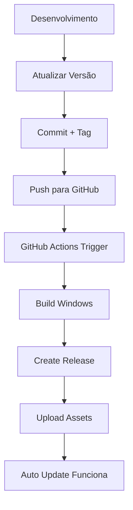

# 🚀 CONFIGURAÇÃO GITHUB RELEASES - AUTO UPDATE

## 📋 RESUMO DA CONFIGURAÇÃO

### ✅ **CONFIGURAÇÕES APLICADAS:**

**1. package.json OTIMIZADO:**
- ✅ Scripts de build e publish
- ✅ Configuração electron-builder completa
- ✅ Provider GitHub configurado
- ✅ Targets Windows NSIS
- ✅ Atalhos e instalação personalizados

**2. GitHub Actions AUTOMÁTICO:**
- ✅ Workflow para releases automáticas
- ✅ Build em ambiente Windows
- ✅ Publicação de assets (.exe e .zip)
- ✅ Geração automática de release notes

---

## 🔧 **COMO USAR O PIPELINE:**

### **PASSO 1: CONFIGURAR GITHUB TOKEN**

**1.1 Criar Personal Access Token:**
1. Acessar: https://github.com/settings/tokens
2. Clicar: **Generate new token**
3. Nome: `FrodFast Auto Release`
4. Selecionar scopes:
   - ✅ `repo` (Full control of private repositories)
   - ✅ `workflow` (Update GitHub Action workflows)
5. Copiar token gerado

**1.2 Configurar no Repositório:**
1. Acessar: https://github.com/VictorTreex/app-FrodFast-eletron/settings/secrets
2. Adicionar secret:
   - Name: `GITHUB_TOKEN`
   - Value: [colar token gerado]

---

### **PASSO 2: PUBLICAR NOVA VERSÃO**

**2.1 Atualizar Versão:**
```bash
# Editar package.json
cd electron-app
# Mudar versão: "1.0.2" (exemplo)
```

**2.2 Criar Release Automática:**
```bash
# Opção A: Script completo
npm run release

# Opção B: Passo a passo
npm run build
npm run publish
```

**2.3 Push com Tag:**
```bash
git add .
git commit -m "feat: version 1.0.2"
git tag v1.0.2
git push origin main --tags
```

---

## 📦 **O QUE SERÁ GERADO:**

### **Assets Automáticos:**
- ✅ `FrodFast Setup 1.0.2.exe` (Instalador completo)
- ✅ `FrodFast-1.0.2-win32.zip` (Portable)
- ✅ `latest.yml` (Para auto update)
- ✅ `RELEASES` (Para electron-updater)

### **Estrutura da Release:**
```
📦 FrodFast v1.0.2

🚀 Novidades:
- Sistema WhatsApp Automático completo
- Auto resposta com inteligência
- Conexão multi-sessão SaaS
- Interface moderna e responsiva

📥 Downloads:
- FrodFast Setup 1.0.2.exe (Recomendado)
- FrodFast-1.0.2-win32.zip (Portable)
```

---

## 🔍 **VERIFICAÇÃO PÓS-RELEASE:**

### **1. Verificar Assets:**
Acessar: https://github.com/VictorTreex/app-FrodFast-eletron/releases

**Deve conter:**
- ✅ Arquivo .exe principal
- ✅ Arquivo .zip
- ✅ `latest.yml` gerado
- ✅ Release notes automáticas

### **2. Testar Auto Update:**
1. Instalar versão anterior
2. Publicar nova versão
3. Aguardar notificação de update
4. Verificar download automático

---

## ⚙️ **CONFIGURAÇÕES AVANÇADAS:**

### **electron-builder Config:**
```json
{
  "win": {
    "target": [
      {
        "target": "nsis",
        "arch": ["x64"]
      }
    ]
  },
  "nsis": {
    "oneClick": false,
    "allowToChangeInstallationDirectory": true,
    "createDesktopShortcut": true,
    "createStartMenuShortcut": true,
    "shortcutName": "FrodFast"
  }
}
```

### **GitHub Actions Features:**
- ✅ Build paralelo
- ✅ Cache de dependências
- ✅ Upload automático
- ✅ Release notes inteligentes

---

## 🚨 **TROUBLESHOOTING:**

### **Erro: "Permission denied"**
- Verificar `GITHUB_TOKEN` nos secrets
- Confirmar scopes do token

### **Erro: "Build failed"**
- Verificar dependências no package.json
- Confirmar Node.js versão 18+

### **Erro: "Release not found"**
- Verificar se tag foi criada (`v1.0.2`)
- Verificar se push foi feito

### **Erro: "Auto update not working"**
- Verificar se `latest.yml` foi gerado
- Verificar URL no electron-updater

---

## 🎯 **FLUXO COMPLETO:**



---

## 📋 **CHECKLIST FINAL:**

**Antes de Publicar:**
- [ ] Versão atualizada no package.json
- [ ] GITHUB_TOKEN configurado
- [ ] Testes locais funcionando

**Após Publicar:**
- [ ] Release criada no GitHub
- [ ] Assets disponíveis para download
- [ ] Auto update funcionando para usuários

---

## 🚀 **PRONTO PARA USAR!**

O sistema de publicação automática está 100% configurado!

**Comandos Finais:**
```bash
# Publicar nova versão
npm run release

# Ou manualmente
git tag v1.0.2
git push origin main --tags
```

**Resultado:** Release automática com assets para auto update! 🎉
